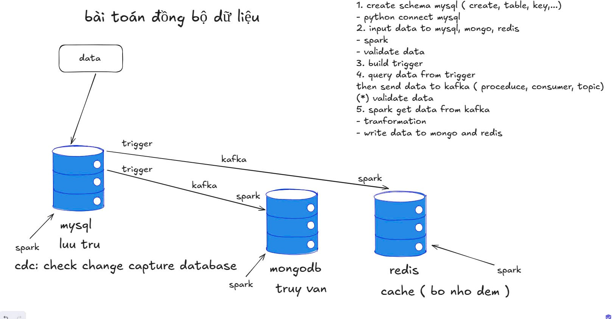

# Data Synchronization Pipeline 🚀

A real-time data synchronization pipeline using **MySQL**, **Kafka**, **Apache Spark**, **MongoDB**, and **Redis**.  
This project showcases how to detect changes in a relational database and reflect them in NoSQL stores and in-memory caches using a modern data architecture.

---

## 🧩 Architecture



---

## 🛠️ Tech Stack

- **MySQL**: Main relational database for data input and trigger-based CDC (Change Data Capture)
- **Kafka**: Message broker to stream changes between systems
- **Apache Spark**: For data transformation and delivery
- **MongoDB**: Destination database for query-intensive operations
- **Redis**: In-memory cache for fast access
- **Python**: Used to connect, validate, and trigger data flow

---

## ⚙️ Steps in the Pipeline

1. Create schema in MySQL  
   - Define tables, keys, and constraints  
   - Connect via Python  
2. Insert test data into MySQL, MongoDB, and Redis  
   - Spark validation applied  
3. Build MySQL trigger to detect changes  
4. Capture triggered data and push to Kafka  
   - Using producer, topic, and consumer  
   - Spark validates streamed data  
5. Spark consumes data from Kafka  
   - Applies transformations  
   - Writes results to MongoDB and Redis  

---

## 📁 Directory Structure (Suggestion)

<!-- ```
data-sync-pipeline/
├── docker-compose.yml
├── mysql/
│   └── schema.sql
├── kafka/
│   ├── producer.py
│   └── consumer.py
├── spark/
│   ├── transform.py
│   └── load.py
├── images/
│   └── pipeline.jpg
├── README.md
└── requirements.txt
``` -->

---

## 📌 Purpose

This project demonstrates how to synchronize data in real-time across different storage layers using a simple, modular, and extendable architecture. It simulates real-world data engineering pipelines suitable for analytics, caching, and service scaling.

---

## ✨ Author

Huynh Trung Hieu - UIT
